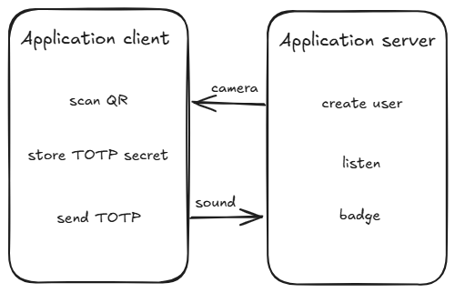

<h1 style="color: var(--slidev-theme-primary)">DMA communication using ultrasound</h1>

Using ggwave

  Zaid Schouwey & Loris Marzullo & Jouve Léonard

---

# Project

### Système de timbrage depuis son téléphone via ultrason

 

  

---

# Communication

  
  ### Utilisation de ggwave:
  - librairie C++ data over sound
  - échantillonnage de données en ultrasons

  ### Problème:
  - authentifier les messages envoyés malgré un débit très faible (16 b/sec)

  ### Utilisation des TOTP:
  - 6 chiffres ~ 6 bytes

  ### Trame:
  - `<TOTP_6_DIGITS><USER_ID>`
  - pas d'autres données transmises (temps / status)

---
layout: two-cols-header
---

# Technologies

 

::left::

# Server

<ul>
  <li>Android Room (data persistance)</li>
  <li>zxing (QR code generation)</li>
  <li>Samstevens TOTP (TOTP library)</li>
  <li>ggwave (C++ data over sound)</li>
  <li>JNI (ggwave interface)</li>
</ul>

::right::

# Client

<ul>
  <li>Android Jetpack DataStore (TOTP secret persistance)</li>
  <li>zxing (QR code generation)</li>
  <li>Google MLKit Barcode Scanner (QR code scan)</li>
  <li>ggwave (C++ data over sound)</li>
  <li>JNI (ggwave interface)</li>
</ul>

